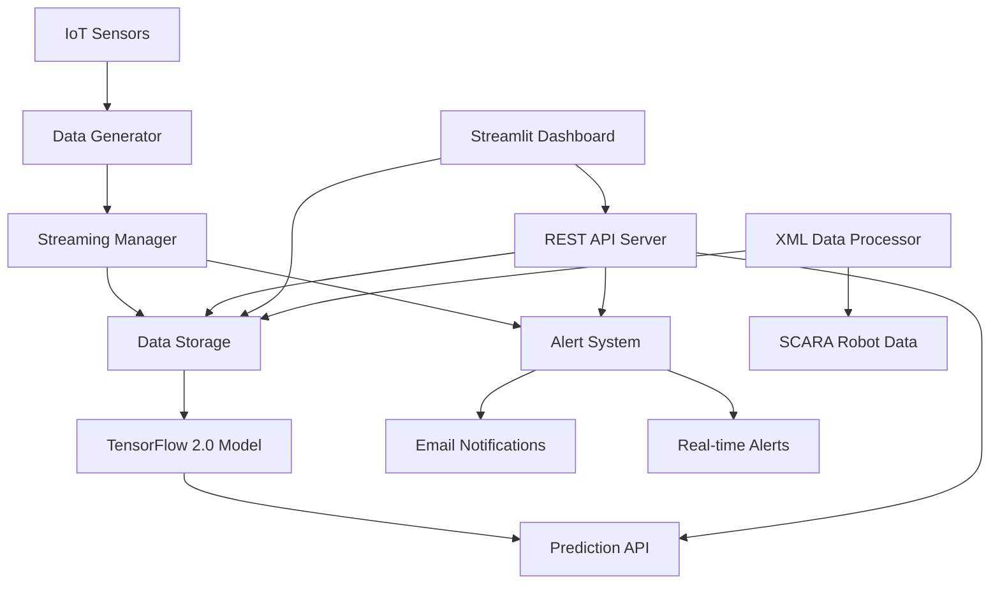

# 🏭 IoT 예측 유지보수 시스템 (TensorFlow 2.0)

현대적인 TensorFlow 2.0 기반으로 완전히 재구성된 IoT 예측 유지보수 시스템입니다. 제조업과 Industry 4.0 환경에서 센서 데이터를 실시간으로 모니터링하고 AI 예측을 통해 장비 고장을 사전에 감지하여 예측 유지보수를 가능하게 합니다.

## 🌟 주요 특징

- **🤖 TensorFlow 2.0 LSTM**: 최신 딥러닝 기술로 장비 고장 예측
- **📊 실시간 모니터링**: Streamlit 기반 웹 대시보드
- **🚨 지능형 알림**: 다단계 임계값 기반 알림 시스템
- **💾 유연한 저장소**: 메모리/CSV/SQLite 다중 저장소 지원
- **🔌 REST API**: Flask 기반 완전한 웹 API
- **📡 실시간 처리**: 메모리 기반 스트리밍 처리
- **⚙️ 설정 관리**: 중앙화된 설정 시스템
- **🔧 모듈화 설계**: 기능별 독립 모듈 구조
- **🦾 SCARA 로봇 지원**: 실제 산업용 로봇 데이터 처리

## 🏗️ 시스템 아키텍처



## 📂 프로젝트 구조

```
├── 📁 core/                    # 핵심 모듈
│   ├── config.py              # 시스템 설정 관리
│   ├── utils.py               # 공통 유틸리티 함수
│   └── data_storage.py        # 데이터 저장소 관리
├── 📁 data/                   # 데이터 관련
│   ├── data_generator.py      # IoT 센서 데이터 생성기
│   └── xml_data/              # XML 데이터 처리
│       ├── xml_data_processor.py      # SCARA 로봇 데이터 처리기
│       ├── debug_xml_data.py         # XML 구조 분석 도구
│       └── run_xml_processing.py     # XML 처리 실행 스크립트
├── 📁 models/                 # AI 모델
│   ├── predictive_model.py    # TensorFlow 2.0 예측 모델
│   └── train_scara_model.py   # SCARA 로봇 모델 훈련
├── 📁 streaming/              # 실시간 처리
│   └── kafka_streaming.py     # 스트리밍 처리 (메모리 기반)
├── 📁 alerts/                 # 알림 시스템
│   └── alert_system.py        # 지능형 알림 관리
├── 📁 api/                    # 웹 API
│   └── api_server.py          # Flask REST API 서버
├── 📁 dashboard/              # 웹 인터페이스
│   └── dashboard.py           # Streamlit 대시보드
├── main_demo.py              # 통합 데모 실행기
├── requirements.txt          # Python 의존성
└── README.md                # 프로젝트 문서
```

## 🚀 빠른 시작

### 1. 환경 설정

```bash
# 가상환경 생성 (권장)
python -m venv venv
source venv/bin/activate  # Windows: venv\Scripts\activate

# 의존성 설치
pip install -r requirements.txt
```

### 2. 통합 데모 실행

```bash
# 전체 시스템 데모 (단계별 실행)
python main_demo.py

# 개별 구성요소 테스트
python main_demo.py data      # 데이터 생성만
python main_demo.py model     # 모델 훈련만
python main_demo.py api       # API 서버만
python main_demo.py dashboard # 대시보드만
python main_demo.py streaming # 스트리밍만
python main_demo.py alert     # 알림 시스템만
```

### 3. 개별 서비스 실행

```bash
# API 서버 시작
python api/api_server.py
# 브라우저: http://localhost:5000/api/health

# 대시보드 시작
streamlit run dashboard/dashboard.py
# 브라우저: http://localhost:8501

# 모델 훈련
python models/predictive_model.py
```

## 🔧 주요 구성요소

### 1. 데이터 생성기 (`data/data_generator.py`)

**10가지 센서 타입**으로 제조업 장비를 완벽 시뮬레이션:

```python
센서 타입:
- 온도 (Temperature): 65°C ± 편차
- 진동 X/Y/Z축 (Vibration): 0.3~0.5 mm/s
- 압력 (Pressure): 2.5 bar ± 편차  
- 회전속도 (RPM): 1800 RPM ± 편차
- 전류/전압 (Current/Voltage): 15A, 220V
- 역률 (Power Factor): 0.95 ± 편차
- 소음 (Noise): 45 dB ± 편차
```

**사용 예시:**
```python
from data.data_generator import IoTSensorDataGenerator

# 디바이스 생성
generator = IoTSensorDataGenerator("DEVICE_001", failure_probability=0.02)

# 실시간 데이터 생성
data = generator.generate_sensor_data()
print(f"건강도: {data['health_score']}%, 상태: {data['status']}")

# 과거 데이터 생성 (30일)
historical_data = generator.generate_historical_data(days=30)
```

### 2. AI 예측 모델 (`models/predictive_model.py`)

**TensorFlow 2.0 LSTM** 기반 고장 예측 시스템:

- **모델 구조**: 다층 LSTM + Dense layers
- **특성 엔지니어링**: 롤링 통계, 트렌드 분석, 복합 특성
- **시계열 처리**: 60분 시퀀스로 10분 후 예측
- **성능 최적화**: 조기 종료, 학습률 스케줄링

```python
from models.predictive_model import IoTPredictiveMaintenanceModel

# 모델 훈련
model = IoTPredictiveMaintenanceModel(sequence_length=60, prediction_horizon=10)
history = model.train(training_data, epochs=50)

# 예측 수행
prediction = model.predict(device_data, device_id="DEVICE_001")
print(f"고장 확률: {prediction['maintenance_probability']:.1%}")
print(f"위험 수준: {prediction['risk_level']}")
```

### 3. SCARA 로봇 데이터 처리 (`data/xml_data/`)

**실제 산업용 SCARA 로봇 데이터 지원**:

- **XML 파싱**: 실제 .dat 파일 처리
- **관절 데이터**: J1, J2, J3, J6 관절 위치/토크/오차
- **좌표계**: Cartesian 및 SCARA 좌표계 지원
- **특성 엔지니어링**: 로봇 특화 복합 특성 생성

```bash
# SCARA 로봇 데이터 처리
cd data/xml_data
python run_xml_processing.py

# 처리된 데이터로 모델 훈련
cd ../../models
python train_scara_model.py
```

### 4. 데이터 저장소 (`core/data_storage.py`)

**3가지 저장소 옵션**으로 다양한 환경 지원:

- **메모리 저장소**: 빠른 프로토타이핑, 실시간 처리
- **CSV 저장소**: 단순한 파일 기반 저장
- **SQLite 저장소**: 관계형 DB, 복잡한 쿼리

```python
from core.data_storage import DataManager

# 저장소 타입 선택
manager = DataManager("memory")  # "csv", "sqlite"

# 데이터 저장 및 조회
manager.save_data(device_id, sensor_data)
retrieved_data = manager.get_data(device_id, count=100)
```

### 5. 알림 시스템 (`alerts/alert_system.py`)

**다층 임계값** 기반 지능형 알림:

- **알림 타입**: 건강도 저하, 이상 점수 높음, 센서 오류
- **우선순위**: Low → Medium → High → Critical
- **쿨다운**: 중복 알림 방지 (15분 기본)
- **이메일 지원**: SMTP 기반 자동 알림

```python
from alerts.alert_system import AlertManager

# 알림 관리자 초기화
alert_manager = AlertManager()

# 사용자 콜백 등록
def alert_handler(alert):
    print(f"🚨 {alert.priority.value.upper()}: {alert.message}")

alert_manager.add_callback(alert_handler)

# 데이터 처리 (자동 알림 체크)
alert_manager.process_data(device_id, sensor_data)
```

### 6. 실시간 스트리밍 (`streaming/kafka_streaming.py`)

**메모리 기반 큐**를 사용한 고성능 스트리밍:

```python
from streaming.kafka_streaming import StreamingManager

# 스트리밍 시스템 설정
manager = StreamingManager()
manager.setup_system([
    {'device_id': 'DEVICE_001', 'failure_probability': 0.02},
    {'device_id': 'DEVICE_002', 'failure_probability': 0.03}
])

# 데이터 처리 콜백
def data_processor(data):
    print(f"수신: {data['device_id']} - 건강도: {data['health_score']:.1f}%")

manager.add_data_callback(data_processor)

# 스트리밍 시작
manager.start_streaming(interval_seconds=5)
```

### 7. REST API (`api/api_server.py`)

**Flask 기반 완전한 웹 API**:

**주요 엔드포인트:**
```http
POST /api/auth/login           # 사용자 인증
GET  /api/devices             # 디바이스 목록
GET  /api/devices/{id}/data   # 실시간 센서 데이터
POST /api/predict/{id}        # 고장 예측
GET  /api/stats/summary       # 시스템 통계
GET  /api/health             # 서버 상태
```

**사용 예시:**
```python
import requests

# 로그인
response = requests.post('http://localhost:5000/api/auth/login', 
                        json={'username': 'admin', 'password': 'password123'})
token = response.json()['token']

# API 호출
headers = {'Authorization': f'Bearer {token}'}
response = requests.get('http://localhost:5000/api/devices', headers=headers)
print(response.json())
```

### 8. 웹 대시보드 (`dashboard/dashboard.py`)

**Streamlit 기반 4페이지 구성**:

- **📊 실시간 모니터링**: 디바이스 상태, 차트, 알림
- **📈 데이터 분석**: 과거 데이터 분석, 상관관계, 패턴
- **🤖 모델 훈련**: AI 모델 훈련 및 평가 인터페이스
- **⚙️ 시스템 설정**: 임계값, 알림 설정, 데이터 관리

```bash
# 대시보드 실행
streamlit run dashboard/dashboard.py
# 브라우저에서 http://localhost:8501 접속
```

## ⚙️ 설정 관리

### 중앙화된 설정 (`core/config.py`)

```python
# 주요 설정 클래스들
- Config: 기본 시스템 설정
- IoTSensorConfig: 센서 기준값, 임계값
- ModelConfig: AI 모델 하이퍼파라미터  
- DashboardConfig: 대시보드 설정
- APIConfig: API 서버 설정
- AlertConfig: 알림 시스템 설정
```

### 환경 변수 지원

```bash
# 주요 환경 변수
export DEBUG=True
export API_PORT=5000
export LOG_LEVEL=INFO
export EMAIL_ENABLED=False
export SMTP_SERVER=smtp.gmail.com
```

## 📊 사용 시나리오

### 1. 실시간 모니터링

```python
# 실시간 시스템 구성
from data.data_generator import IoTSensorDataGenerator
from alerts.alert_system import AlertManager
from core.data_storage import DataManager

# 컴포넌트 초기화
generator = IoTSensorDataGenerator("PUMP_001")
alert_manager = AlertManager()
storage = DataManager("sqlite")

# 실시간 루프
while True:
    # 센서 데이터 생성
    data = generator.generate_sensor_data()
    
    # 저장
    storage.save_data(data['device_id'], data)
    
    # 알림 체크
    alert_manager.process_data(data['device_id'], data)
    
    time.sleep(60)  # 1분 간격
```

### 2. SCARA 로봇 데이터 처리

```python
# XML 데이터 처리 및 AI 모델 훈련
from data.xml_data.xml_data_processor import FixedXMLDataProcessor
from models.predictive_model import IoTPredictiveMaintenanceModel

# XML 데이터 처리
processor = FixedXMLDataProcessor('.')
processed_data = processor.process_full_pipeline(
    file_pattern="*.dat",
    time_interval='10S',
    save_result=True
)

# AI 모델 훈련
model = IoTPredictiveMaintenanceModel()
model.train(processed_data, epochs=50)
model.save_model("scara_robot_model")
```

### 3. 배치 예측 분석

```python
# 과거 데이터로 모델 훈련 및 평가
import pandas as pd
from models.predictive_model import IoTPredictiveMaintenanceModel

data = pd.read_csv('historical_data.csv')

# 모델 훈련
model = IoTPredictiveMaintenanceModel()
model.train(data, epochs=100)
model.save_model("production_model")

# 배치 예측
predictions = []
for device_id in data['device_id'].unique():
    device_data = data[data['device_id'] == device_id]
    pred = model.predict(device_data, device_id)
    predictions.append(pred)

# 결과 분석
high_risk_devices = [p for p in predictions if p['risk_level'] == 'high']
print(f"고위험 장비: {len(high_risk_devices)}개")
```

### 4. API 기반 통합

```python
# 외부 시스템과의 API 통합
class MESIntegration:
    def __init__(self, api_base_url):
        self.api_url = api_base_url
        self.token = self.login()
    
    def get_predictions(self):
        response = requests.post(f'{self.api_url}/api/predict/batch', 
                               headers={'Authorization': f'Bearer {self.token}'})
        return response.json()['predictions']
    
    def schedule_maintenance(self, device_id):
        # 외부 MES 시스템에 유지보수 스케줄 등록
        pass

# 사용
mes = MESIntegration('http://iot-system:5000')
predictions = mes.get_predictions()
for pred in predictions:
    if pred['maintenance_needed']:
        mes.schedule_maintenance(pred['device_id'])
```

## 🔧 확장 및 커스터마이징

### 새로운 센서 타입 추가

```python
# core/config.py의 IoTSensorConfig에 추가
SENSOR_BASELINES = {
    'existing_sensors': '...',
    'new_sensor': 100.0,  # 새 센서 기준값
}

SENSOR_RANGES = {
    'existing_ranges': '...',
    'new_sensor': (80, 120),  # 허용 범위
}
```

### 커스텀 알림 규칙

```python
# 새로운 알림 규칙 정의
from alerts.alert_system import AlertRule, AlertType, AlertPriority

custom_rule = AlertRule(
    name="custom_condition",
    condition=lambda data: data.get('custom_metric') > threshold,
    alert_type=AlertType.SYSTEM_ERROR,
    priority=AlertPriority.HIGH,
    message_template="커스텀 조건 만족: {device_id}",
    cooldown_minutes=30
)

alert_manager.add_rule(custom_rule)
```

### 새로운 저장소 백엔드

```python
# 새로운 저장소 클래스 구현
from core.data_storage import DataStorage

class CustomStorage(DataStorage):
    def save_device_data(self, device_id: str, data: Dict) -> bool:
        # 커스텀 저장 로직
        pass
    
    def get_device_data(self, device_id: str, count: int) -> pd.DataFrame:
        # 커스텀 조회 로직
        pass

# DataManager에서 사용
manager = DataManager("custom")
manager.storage = CustomStorage()
```

## 🐛 문제 해결

### 일반적인 문제들

1. **모델 훈련 메모리 부족**
   ```python
   # 배치 크기 줄이기
   model.train(data, batch_size=16, epochs=30)
   ```

2. **API 서버 포트 충돌**
   ```bash
   # 다른 포트 사용
   export API_PORT=5001
   python api/api_server.py
   ```

3. **대시보드 연결 오류**
   ```bash
   # API 서버 먼저 시작 확인
   curl http://localhost:5000/api/health
   ```

4. **XML 데이터 처리 오류**
   ```bash
   # 디버그 모드로 실행
   cd data/xml_data
   python debug_xml_data.py --dir .
   ```

### 로그 확인

```bash
# 로깅 레벨 설정
export LOG_LEVEL=DEBUG

# 로그 파일 위치
ls logs/
# app.log, api_server.log, predictive_model.log 등
```

## 📈 성능 최적화

### 메모리 사용량 최적화

```python
# 데이터 버퍼 크기 조정
dashboard_config.MAX_DATA_POINTS = 500  # 기본 1000

# 배치 크기 조정
model_config.BATCH_SIZE = 16  # 기본 32
```

### 예측 속도 향상

```python
# 시퀀스 길이 단축
model_config.SEQUENCE_LENGTH = 30  # 기본 60

# 특성 수 제한
selected_features = ['temperature', 'vibration_x', 'current']
```

### SCARA 로봇 데이터 최적화

```python
# XML 처리 시 샘플링 간격 조정
processor.process_full_pipeline(
    time_interval='10S',  # 10초 간격 (기본 5초)
    max_files=10  # 파일 수 제한
)
```

## 🧪 테스트

### 단위 테스트 실행

```bash
# 각 모듈 테스트
python data/data_generator.py
python models/predictive_model.py
python core/data_storage.py
python alerts/alert_system.py
python core/utils.py
```

### 통합 테스트

```bash
# 전체 시스템 테스트
python main_demo.py
```

### 성능 테스트

```python
# 대량 데이터 처리 테스트
from core.utils import timer

@timer
def performance_test():
    generator = IoTSensorDataGenerator("PERF_TEST")
    for i in range(1000):
        data = generator.generate_sensor_data()
        # 처리 로직
```

### XML 데이터 테스트

```bash
# SCARA 로봇 데이터 테스트
cd data/xml_data
python run_xml_processing.py test  # 빠른 테스트
python debug_xml_data.py --test    # 구조 분석
```

## 📋 기술 스택

- **AI/ML**: TensorFlow 2.0, scikit-learn, NumPy, Pandas
- **웹 프레임워크**: Flask (API), Streamlit (대시보드)
- **데이터베이스**: SQLite, CSV, 메모리 저장소
- **실시간 처리**: 메모리 기반 큐 시스템
- **시각화**: Plotly, Matplotlib, Seaborn
- **인증**: JWT 토큰 기반
- **데이터 형식**: JSON, CSV, XML
- **로깅**: Python logging 모듈

---